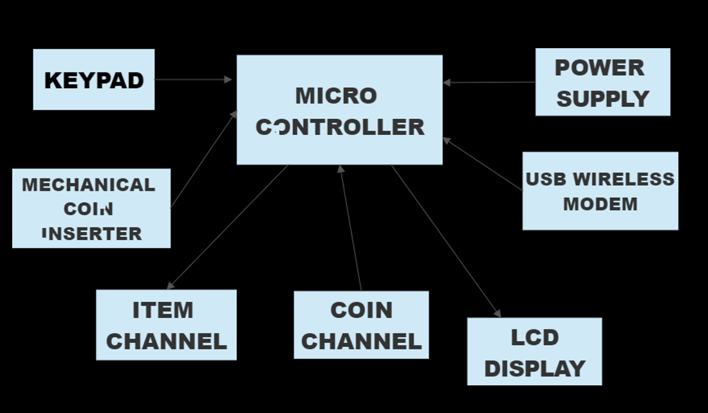

# AUTOMATIC VENDING MACHINE
# INTRODUCTION
when the user inserts the coin in the coin inlet for the Items inside the machine.The machine can be used for vending  chocolates,snacks and tickets e.t.c.. A vending machine is essentially a shop that has been automated. Products are placed into a machine and are normally accessible for purchase 24 hours a day, seven days a week. Freshly produced beverages, bottles, cans, snacks, and fresh food are frequent vending products. However, it appears like there is no limit to what can be sold nowadays. A vending machine's selection number or corresponding button corresponds to each item. Customers fill out their coin insert/card, select the appropriate item number or button, and then wait for their desired product to be delivered.
# COMPONENTS
LCD-It displays the message and status of the machine Port Deliver,
COIN INLET- where user inserts the coin,
OUTLET-where user collects the item,
Micro controller 8051,
RTOS,
power supply.
# APPLICATIONS
The are various application of Automatic vending machine. Food or beverage vending machines are the most common use for vending machines, used to sell tickets for anything from  Sports to theatre
# HIGH LEVEL REQUIREMENTS
| ID   | DESCRPTION  | STATUS  |
|-------------|-------------------|-----------|
| 01 | User can have items as he wish| present |
| 02 | User can have return change when price is below inserted coin | present |
| 03 | User can have refundable amount when items are finished | present |
| 04 | User can have extra item when there is an offer | present |
| 05 | inserting cash insted of coins | Not present |
# LOW LEVEL REQUIREMENTS
| ID   | DESCRPTION  | STATUS  |
|-------------|-------------------|-----------|
| 01 | User can isert different coins| present |
| 02 | Message dsplay in the lcd | present |
| 03 | Coin inlet | present |
| 04 | Item outlet | present |
| 05 |Automatic change in price of item  | Not present |
# BLOCK DIAGRAM

