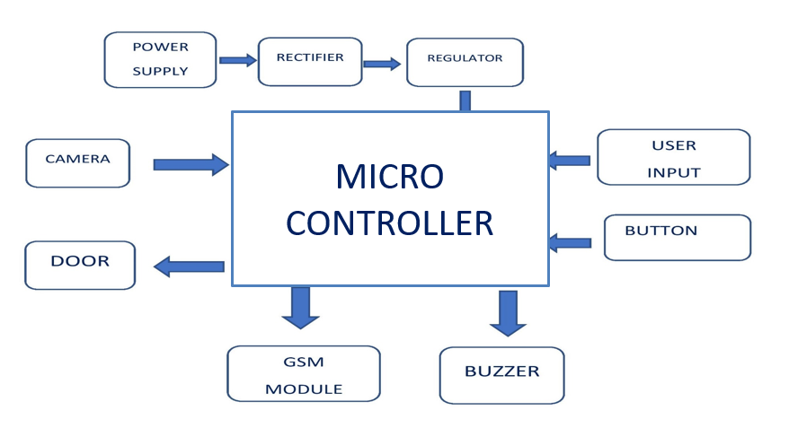

# FACE RECOGNIZATION SYSTEM
# INTRODUCTION
The most important of feature of any  room security system is to detect the people who enter or leave the house.Whenever the person comes in front of the door ,it recognizes the face and if it is registered then it unlocks the door.If the face is not registered it will raise an alarm and clicks a picture and send it on the registered number and registered Gmail.   
# COMPONENTS
It consists of

MICRO CONTROLLER.

GSM MODULE.

USB CAMERA.

BUZZER.

MOTOR.
# APPLICATION
Providing a way for the owner of the house to provide access to multiple users without compromising the security as well as getting updated about the activities.Face recognition based access control system has been developed to provide better security.This system can be used in several places where high security is required where confidential information and equipment is kept.
# BLOCK DIAGRAM

